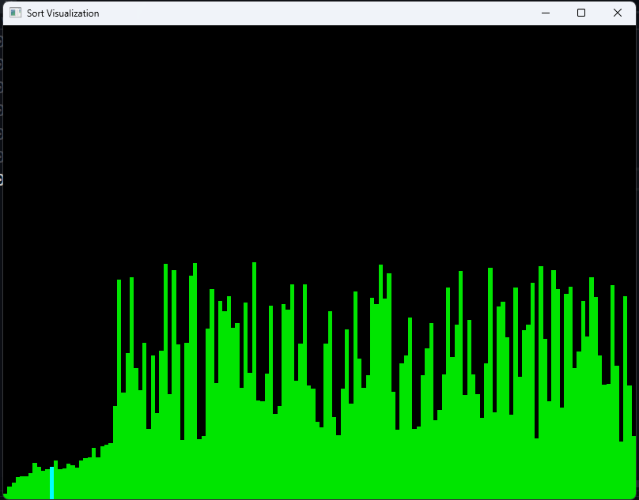

# Sorting Algorithm Visualization with OpenGL

This project visualizes the Quick Sort algorithm using OpenGL and GLFW. The program generates random data and demonstrates the sorting process in real-time by animating the data as vertical bars.



## Features
- **Quick Sort Visualization:** See how the Quick Sort algorithm works by highlighting swaps and pivot selections.
- **OpenGL Rendering:** Uses OpenGL to draw bars representing array elements.
- **GLFW Integration:** Creates an interactive window to display the sorting visualization.

## Prerequisites

### Libraries and Tools
1. **GLFW** - Install the GLFW library for creating an OpenGL context and managing window/input events.
2. **OpenGL** - The project requires OpenGL for rendering.
3. **C++ Compiler** - Ensure your compiler supports C++20 for best compatibility.

### Installation on Windows
1. Clone the repository:
   ```bash
   git clone https://github.com/AhmedSamyMousa/Algorithm-Visualization-OpenGl
   cd Algorithm Visualization(OpenGl)
